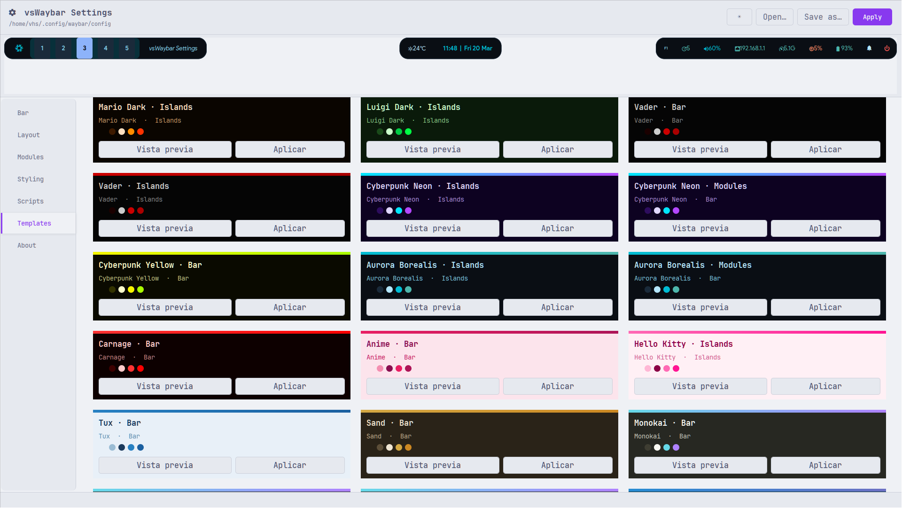
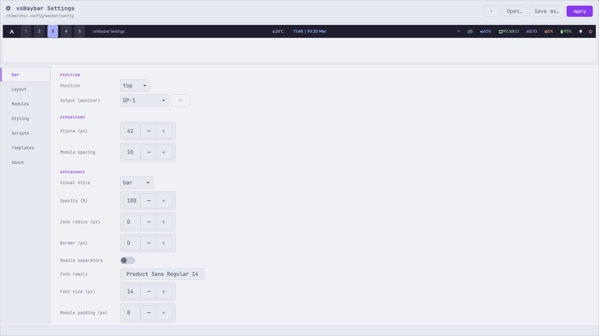
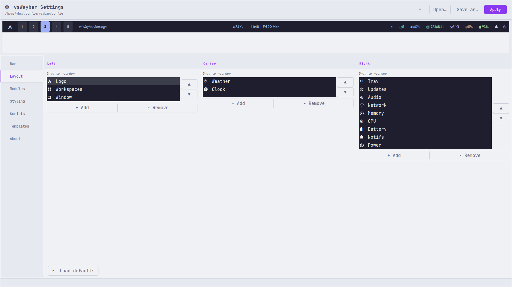
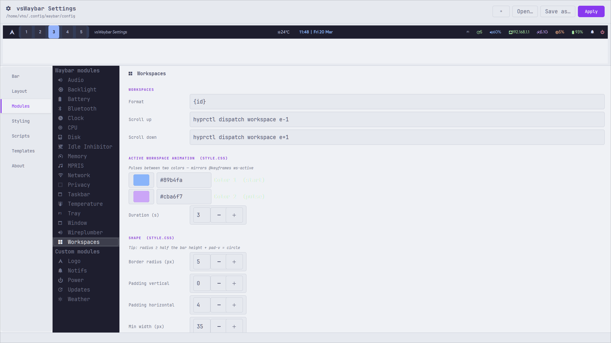
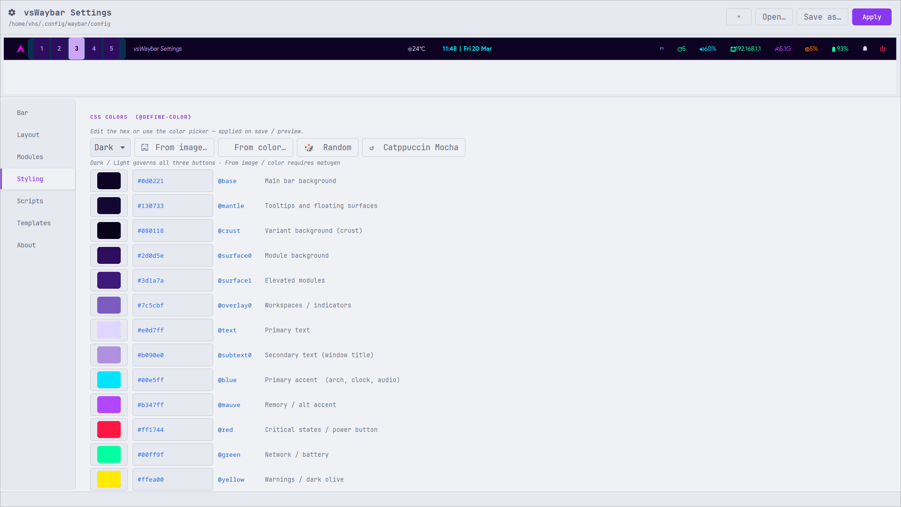

# vsWaybar Studio

[](https://aur.archlinux.org/packages/vswaybar-studio)
[](LICENSE)

A visual configuration editor for [Waybar](https://github.com/Alexays/Waybar) — build, style and preview your bar in real time.

No more editing JSON and CSS by hand. Design your Waybar with live feedback, templates and full module control.

> Available on the AUR as [`vswaybar-studio`](https://aur.archlinux.org/packages/vswaybar-studio).
> Single-file Python 3 + GTK3 application.

---

## Screenshots

### Templates


### Bar Settings


### Layout Editor


### Module Config


### Styling / Color Palette


---

## Features

- **Live bar preview** — a thin strip at the top mirrors your actual Waybar in real time
- **Bar settings** — position, output/monitor, height, spacing, margins, layer
- **Visual styles** — Bar (solid), Islands (floating zones), Modules (per-pill)
- **Layout editor** — drag modules between Left / Center / Right zones
- **Module config** — click any module to edit its specific settings (format, intervals, on-click actions, colors, animations…)
- **Styling** — edit all 14 CSS color tokens, font, opacity, border-radius, padding
- **Templates** — 54 ready-made themes across 36 color palettes and 3 visual styles; apply with one click
- **Palette tools** — load from image via [matugen](https://github.com/InioX/matugen), or generate a random palette
- **Scripts editor** — edit `weather.py` and other custom scripts in-place
- **Dark / Light editor theme** toggle
- Apply writes `config` + `style.css` to disk and restarts Waybar automatically

---

## Requirements

- Python 3.10+
- `python-gobject` (GTK3 bindings)
- `python-cairo`
- [Waybar](https://github.com/Alexays/Waybar)
- [Hyprland](https://github.com/hyprwm/Hyprland) (for `hyprland/workspaces` and `hyprland/window` modules)

Optional:
- [matugen](https://github.com/InioX/matugen) — palette generation from wallpaper
- [swaync](https://github.com/ErikReider/SwayNotificationCenter) — notification center module
- [wlogout](https://github.com/ArtsyMacaw/wlogout) — power menu module

---

## Installation

### AUR (Arch Linux)

```bash
yay -S vswaybar-studio
# or
paru -S vswaybar-studio
```

### Manual

```bash
git clone https://github.com/victorsosaMx/vsWaybar-Studio
cd vsWaybar-Studio
chmod +x vswaybar-studio
./vswaybar-studio
```

The editor reads `~/.config/waybar/config` and `~/.config/waybar/style.css` on startup.
**Apply** writes both files back and restarts Waybar.

---

## Included Color Palettes

### Standard themes
| Palette | Source |
|---|---|
| Catppuccin Mocha / Latte / Macchiato / Frappe | [catppuccin/catppuccin](https://github.com/catppuccin/catppuccin) |
| Dracula | [dracula/dracula-theme](https://github.com/dracula/dracula-theme) |
| Nord / Nord Light | [nordtheme/nord](https://github.com/nordtheme/nord) |
| Gruvbox Dark / Light | [morhetz/gruvbox](https://github.com/morhetz/gruvbox) |
| Tokyo Night | [folke/tokyonight.nvim](https://github.com/folke/tokyonight.nvim) |
| One Dark | [atom/one-dark-ui](https://github.com/atom/one-dark-ui) |
| Rosé Pine | [rose-pine/rose-pine-theme](https://github.com/rose-pine/rose-pine-theme) |
| Everforest | [sainnhe/everforest](https://github.com/sainnhe/everforest) |
| Kanagawa | [rebelot/kanagawa.nvim](https://github.com/rebelot/kanagawa.nvim) |
| Solarized Dark / Light | [altercation/solarized](https://github.com/altercation/solarized) |
| Monokai | [monokai.pro](https://monokai.pro) |
| GitHub Dark | [primer/primitives](https://github.com/primer/primitives) |

### Custom palettes
Forest Night, Forest, Forest Daylight, Mario, Mario Dark, Luigi Dark, Vader, Cyberpunk Neon, Cyberpunk Yellow, Anime, Aurora Borealis, Carnage, Hello Kitty, Tux, Sand, Ubuntu Dark, Ice Mint, Retro Paper.

---

## Acknowledgements

This project is built on top of amazing open-source work:

**Runtime**
- [Waybar](https://github.com/Alexays/Waybar) by Alexis Rouillard — the status bar this editor configures
- [Hyprland](https://github.com/hyprwm/Hyprland) by Vaxry — the Wayland compositor
- [GTK3](https://www.gtk.org/) / [PyGObject](https://gitlab.gnome.org/GNOME/pygobject) — GUI toolkit and Python bindings
- [PyCairo](https://pycairo.readthedocs.io/) — 2D graphics for the bar preview

**Tools integrated**
- [matugen](https://github.com/InioX/matugen) by InioX — material-you palette generator from wallpaper
- [SwayNotificationCenter](https://github.com/ErikReider/SwayNotificationCenter) by Erik Reider — notification center (`custom/swaync` module)
- [wlogout](https://github.com/ArtsyMacaw/wlogout) — Wayland logout / power menu (`custom/power` module)
- [Kitty](https://github.com/kovidgoyal/kitty) by Kovid Goyal — terminal emulator used by the updates module
- [JetBrains Mono Nerd Font](https://github.com/ryanoasis/nerd-fonts) — icons used throughout the bar modules

**Module app integrations** *(default on-click actions — all configurable)*
- [ML4W Calendar](https://github.com/mylinuxforwork/dotfiles) (`com.ml4w.calendar`) — calendar app launched from the clock module
- [Mousam](https://github.com/amit9838/mousam) by Amit Sharma (`io.github.amit9838.mousam`) — weather app launched from the weather module
- [NetworkManager](https://networkmanager.dev/) / `nm-connection-editor` — network settings launched from the network module
- [pavucontrol](https://freedesktop.org/software/pulseaudio/pavucontrol/) — PulseAudio volume control launched from the audio module
- [pacman-contrib](https://gitlab.archlinux.org/pacman/pacman-contrib) (`checkupdates`) — used by the updates module to count pending packages
- [OpenWeatherMap API](https://openweathermap.org/api) — weather data source for `weather.py` (free API key required)
- [vsFetch](https://github.com/victorsosaMx/vsFetch) — system info fetcher launched from the arch logo module

**Color palettes**
- [Catppuccin](https://github.com/catppuccin/catppuccin) — Soothing pastel theme framework
- [Dracula](https://github.com/dracula/dracula-theme) — Dark theme for everything
- [Nord](https://github.com/nordtheme/nord) — Arctic, north-bluish color palette
- [Gruvbox](https://github.com/morhetz/gruvbox) by Pavel Pertsev — retro groove color scheme
- [Tokyo Night](https://github.com/folke/tokyonight.nvim) by Folke Lemaitre
- [One Dark](https://github.com/atom/one-dark-ui) — Atom's iconic dark theme
- [Rosé Pine](https://github.com/rose-pine/rose-pine-theme) — Soho vibes for the technically minded
- [Everforest](https://github.com/sainnhe/everforest) by sainnhe — Green-based warm color scheme
- [Kanagawa](https://github.com/rebelot/kanagawa.nvim) by rebelot — Inspired by the colors of the famous painting
- [Solarized](https://ethanschoonover.com/solarized/) by Ethan Schoonover — Precision colors for machines and people
- [Monokai](https://monokai.pro) by Wimer Hazenberg — The original dark color scheme

---

## License

MIT — do whatever you want, credit appreciated.

---

*Made with GTK3 and too much caffeine.*
